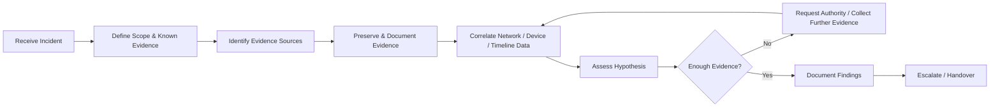

# Digital Forensics Case Studies

## Overview

This repository presents two university digital-forensics case studies completed as part of my BSc Ethical Hacking and Cybersecurity degree.

Both exercises were primarily **investigative and procedural rather than live forensic-lab deployments**. The value of the work is in the way evidence was identified, preserved, correlated, documented and escalated.

The case studies demonstrate several skills directly relevant to SOC / Security Analyst work:

- incident triage and scoping
- evidence preservation and chain of custody
- hypothesis-driven investigation
- correlation of network and device evidence
- documentation and auditability
- escalation and handover
- legal / policy awareness
- minimising unnecessary changes to evidence

## Case Study 1 — First Response and Evidence Preservation

The first case study involved a simulated workplace cyberbullying incident. The task was to prepare for and document the **first-response and evidence-seizure process** before forensic examination.

### Key investigative decisions

- identify likely evidence sources before seizure
- prepare evidence logs and contemporary notes
- use security-sealed evidence bags to preserve integrity
- use a write blocker before imaging storage media
- use FTK Imager for a bit-for-bit forensic image where required
- photograph device state and physical layout before seizure
- document every action so another investigator could reproduce the process
- hand evidence and documentation to the forensic examiner after acquisition

This case study is detailed in [case-study-1-first-response.md](docs/case-study-1-first-response.md).

## Case Study 2 — Network Evidence, BYOD and Investigative Scope

The second case study concerned alleged staff misconduct involving social media and personally owned mobile devices used on a school network.

The investigation combined **policy context, network communication records and device evidence** to decide what further action was justified.

### Key investigative decisions

- define the initial hypothesis and known evidence
- correlate incident timestamps with network communication records
- identify which devices were associated with the relevant connections
- distinguish policy breach from evidence of a criminal offence
- request further authority before seizure where more evidence was needed
- avoid unnecessary device examination where existing evidence was sufficient
- maintain contemporaneous notes and an auditable investigation record

This case study is detailed in [case-study-2-network-evidence-and-byod.md](docs/case-study-2-network-evidence-and-byod.md).

## Investigation Workflow



More detail is available in [investigation-workflow.md](docs/investigation-workflow.md).

## Why This Matters for Analyst Roles

Although these were academic scenarios, the underlying skills map closely to day-to-day security analysis.

| Forensics Skill | Analyst Relevance |
|---|---|
| Preserve evidence before making changes | Avoid destroying useful artefacts during incident response |
| Maintain contemporary notes | Create defensible ticket history and investigation records |
| Correlate timestamps and network activity | Reconstruct attack or user activity timelines |
| Form and test hypotheses | Investigate alerts methodically rather than guessing |
| Identify appropriate evidence sources | Know which logs, endpoints and network data to review |
| Escalate when evidence or authority is insufficient | Follow incident-response and escalation procedures |
| Minimise unnecessary examination | Reduce risk, noise and privacy impact |
| Chain of custody and audit trail | Support regulated, legal or high-severity investigations |

See [analyst-skills-mapping.md](docs/analyst-skills-mapping.md) for a fuller mapping.

## Tools and Concepts Referenced

- FTK Imager
- write blockers
- forensic imaging
- evidence logs
- contemporary notes
- chain of custody
- security-sealed evidence handling
- network communication records
- BYOD / Acceptable Use policies
- ACPO digital-evidence principles

## Retrospective

These case studies reflect my knowledge at the time they were completed.

With my current security-operations perspective, I would strengthen the work by:

- building a clearer event timeline before forming conclusions
- separating facts, assumptions and hypotheses explicitly
- recording evidence source, timestamp, owner and confidence for each finding
- using hashes to verify forensic images and evidence integrity
- defining escalation thresholds and ownership more clearly
- mapping investigative steps to an incident-response lifecycle
- documenting alternative explanations before closing a hypothesis
- avoiding legal conclusions unless supported by the appropriate authority

The repository does not claim live production forensic examinations that did not occur. It presents the investigative reasoning, evidence-handling principles and decision-making demonstrated in the original coursework.

## Repository Structure

```text
.
├── README.md
└── docs/
    ├── case-study-1-first-response.md
    ├── case-study-2-network-evidence-and-byod.md
    ├── investigation-workflow.md
    └── analyst-skills-mapping.md
```